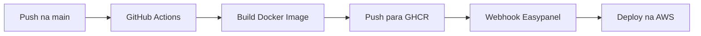

# Guia de Deploy - AERION Elevate Hub

Este guia explica como configurar o deploy automático do projeto no Easypanel rodando na AWS.

## 📋 Pré-requisitos

- Conta no GitHub com o repositório configurado
- Instância Easypanel rodando na AWS
- Projeto Supabase configurado (veja [SUPABASE_SETUP.md](./SUPABASE_SETUP.md))

## 🚀 Configuração do Easypanel

### 1. Criar Projeto no Easypanel

1. Acesse seu painel do Easypanel
2. Clique em **"Create Project"**
3. Nome do projeto: `aerion-elevate-hub`
4. Escolha **"Docker Image"** como tipo de deploy

### 2. Configurar Docker Image

Na configuração do projeto:

- **Image Source**: GitHub Container Registry
- **Image URL**: `ghcr.io/[seu-usuario]/aerion-elevate-hub:latest`
- **Port**: `80`

### 3. Configurar Variáveis de Ambiente

No Easypanel, adicione as seguintes variáveis de ambiente:

```
VITE_SUPABASE_URL=https://[seu-projeto].supabase.co
VITE_SUPABASE_ANON_KEY=[sua-chave-anon-aqui]
```

### 4. Obter Webhook URL

1. No Easypanel, vá para as configurações do projeto `aerion-elevate-hub`
2. Procure por **"Webhooks"** ou **"Deploy Triggers"**
3. Copie a URL do webhook (algo como: `https://easypanel.io/api/deploy/webhook/[token]`)
4. Guarde esta URL para configurar no GitHub

## 🔐 Configurar GitHub Secrets

1. Vá para o repositório no GitHub
2. Acesse **Settings > Secrets and variables > Actions**
3. Clique em **"New repository secret"**
4. Adicione os seguintes secrets:

| Nome | Valor | Descrição |
|------|-------|-----------|
| `VITE_SUPABASE_URL` | `https://xxx.supabase.co` | URL do seu projeto Supabase |
| `VITE_SUPABASE_ANON_KEY` | `eyJhbG...` | Chave anônima do Supabase |
| `EASYPANEL_WEBHOOK_URL` | `https://easypanel.io/api/...` | URL do webhook do Easypanel |

## 🔄 Pipeline de Deploy (GitHub Actions)

O pipeline já está configurado no arquivo `.github/workflows/deploy.yml` e funciona assim:

### Fluxo de Deploy

1. **Trigger**: Push na branch `main`
2. **Build**: Constrói a imagem Docker com as variáveis de ambiente
3. **Push**: Envia a imagem para GitHub Container Registry (ghcr.io)
4. **Deploy**: Chama o webhook do Easypanel para atualizar o container

### Como Funciona



## 📦 Build Local (Opcional)

Para testar o build Docker localmente:

```bash
# Build da imagem
npm run docker:build

# Executar localmente
npm run docker:run

# Acessar em http://localhost
```

## 🌐 Primeiro Deploy

Depois de configurar tudo:

1. Faça commit de suas alterações:
   ```bash
   git add .
   git commit -m "Configure CI/CD pipeline"
   git push origin main
   ```

2. Acompanhe o progresso:
   - GitHub: Vá para **Actions** para ver o pipeline
   - Easypanel: Verifique os logs do deploy

3. Acesse seu site:
   - URL fornecida pelo Easypanel
   - Configure domínio customizado se desejar

## 🔧 Configuração de Domínio (Opcional)

No Easypanel:

1. Vá para configurações do projeto
2. Adicione seu domínio customizado
3. Configure os registros DNS conforme instruções
4. Ative SSL (geralmente automático com Let's Encrypt)

## 🐛 Troubleshooting

### Build Falha

- Verifique se as variáveis de ambiente estão configuradas nos GitHub Secrets
- Veja os logs no GitHub Actions

### Deploy não Atualiza

- Verifique se o webhook URL está correto
- Confirme que o Easypanel tem acesso ao GitHub Container Registry
- Tente fazer um deploy manual no Easypanel

### Aplicação não Inicia

- Verifique os logs no Easypanel
- Confirme que as variáveis de ambiente estão corretas
- Teste o build localmente com Docker

## 📊 Monitoramento

- **Logs**: Acesse os logs em tempo real no Easypanel
- **Health Check**: O container possui um endpoint `/health`
- **Métricas**: Use o painel do Easypanel para monitorar uso de recursos

## 🔄 Atualizações Futuras

Todos os pushes na branch `main` disparam automaticamente:

1. Build da nova imagem
2. Push para o registry
3. Deploy no Easypanel

**Não é necessário intervenção manual!** 🎉

## 📝 Notas Importantes

- O primeiro deploy pode levar mais tempo (~5-10 minutos)
- Deploys subsequentes são mais rápidos devido ao cache de layers
- A imagem é otimizada com multi-stage build
- Nginx serve a aplicação com compressão Gzip ativada
- SSL deve ser configurado no Easypanel/AWS, não no container

## 🆘 Suporte

Se encontrar problemas:

1. Verifique os logs no GitHub Actions
2. Verifique os logs no Easypanel
3. Confirme que todas as variáveis de ambiente estão configuradas
4. Teste o build localmente com Docker

## 🔗 Links Úteis

- [Documentação do Easypanel](https://easypanel.io/docs)
- [GitHub Actions Docs](https://docs.github.com/actions)
- [Docker Documentation](https://docs.docker.com/)
- [Supabase Setup](./SUPABASE_SETUP.md)

